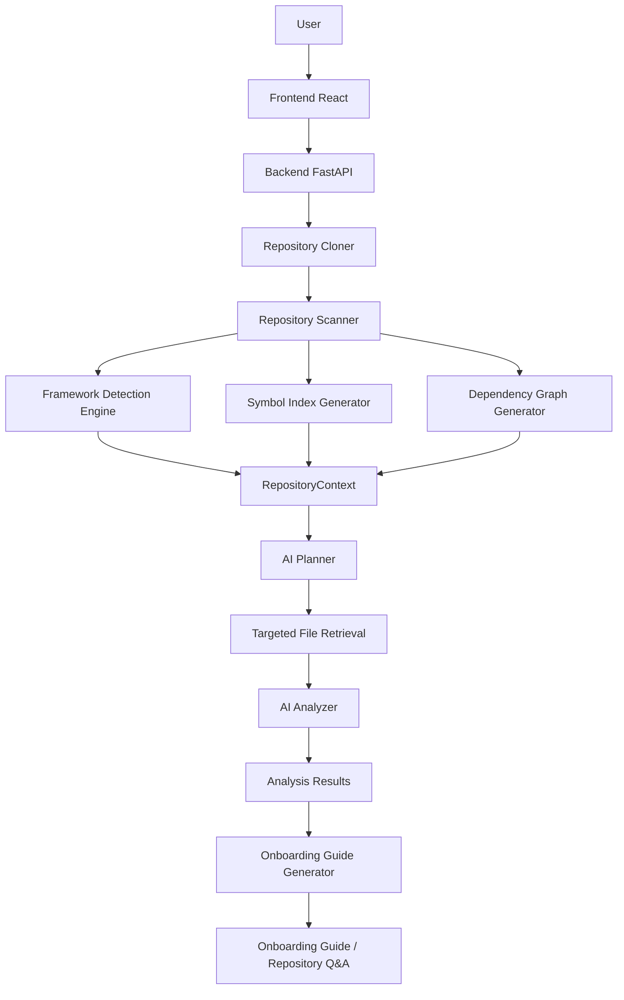

# Architecture

## Vision

This document summarizes the high-level architecture for the GitHub Repo Intelligence platform. The system performs deterministic repository analysis (framework detection, symbol indexing, dependency graphing) and uses targeted LLM calls to generate onboarding guides and answer repository-specific questions with evidence.

## High-Level Architecture

The platform is backend-first and framework-agnostic. Key components:

- Repository Cloner — clones provided GitHub repos for analysis.
- Repository Scanner — walks the repository, detects important files and languages.
- Framework Detection Engine — applies detectors and rule sets to infer frameworks.
- Symbol Index Generator — extracts symbols (classes, functions, interfaces) per language.
- Dependency Graph Generator — maps relationships between symbols and modules.
- RepositoryContext — single source of truth that aggregates metadata, symbols, graphs, and evidence.
- AI Planner & Analyzer — ask an LLM which files/symbols to inspect and produce evidence-backed analysis.
- Onboarding Guide Generator — creates human-readable guides and Q&A outputs.

## Pipeline Overview

1. Repository Scan — identify root files (README, package files, build files, Dockerfiles, etc.).
2. Structure Analysis — compute folder hierarchy and entry points.
3. Symbol Indexing — extract language-specific symbols.
4. Dependency Graph — compute relationships between symbols.
5. AI Planning — produce a targeted list of files and symbols for deeper analysis.
6. AI Analysis — run focused LLM calls on selected artifacts, returning evidence-backed outputs.
7. Onboarding Guide Generation — assemble final guide and Q&A interface.

## Diagram

## Technology Notes

- Backend: FastAPI
- Storage: SQLite (analysis caching)
- Initial language support: Java, Python, TypeScript
- V1 frameworks: Spring Boot, FastAPI, React

Refer to `docs/project-spec.md` for the full pipeline and design rationale.
