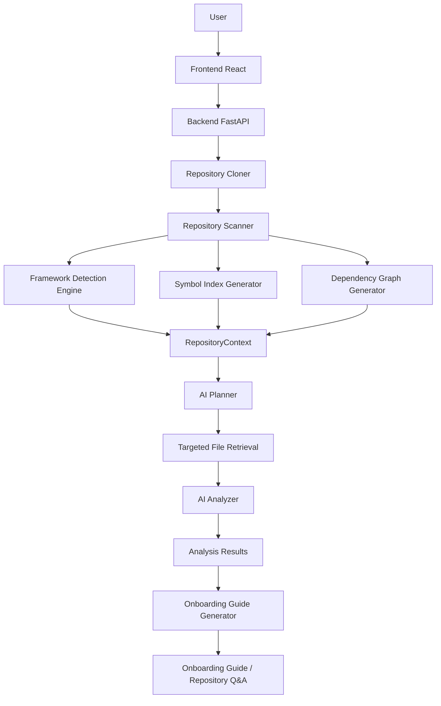

# GitHub Repo Intelligence Platform

## Vision

An AI-powered platform that helps developers understand unfamiliar GitHub repositories by generating onboarding guides and answering repository-specific questions using repository-aware code intelligence and evidence from the codebase.

---

## Problem Statement

Developers spend significant time understanding new codebases. Important information is spread across source code, configuration files, APIs, database layers, and infrastructure configurations.

Most AI tools treat repositories as documents. This project treats repositories as structured systems by extracting framework information, symbols, dependencies, and architecture before involving an LLM.

This reduces onboarding time while minimizing AI cost and improving explainability.

---

## Target Users

* New developers joining a project
* Open-source contributors
* Engineering managers evaluating repositories
* Students learning from public repositories
* Non-technical stakeholders seeking high-level understanding

---

## Core Features

### Repository Analysis

* Accept GitHub repository URL
* Clone repository
* Scan repository structure
* Detect frameworks and technologies
* Build symbol index
* Build dependency graph
* Identify important files

### AI Onboarding Guide

Generate:

* Project Overview
* Tech Stack
* Folder Structure
* Important APIs
* Database Flow
* Authentication Flow
* Recommended Reading Order
* Key Files

### Repository Q&A

Allow users to ask:

* How does authentication work?
* How is the database connected?
* Which file starts the application?
* What are the main APIs?
* How does data flow through the application?

---

## Evidence-Based Output

Every generated insight should include supporting evidence.

Examples:

* Source file names
* Configuration files
* Dependencies
* APIs
* Relevant code snippets

---

## Design Principles

1. Evidence-based outputs
2. Minimize LLM calls
3. Backend-first code intelligence
4. Framework-agnostic architecture
5. Explainable AI responses
6. Extensible language support

---

## AI Cost Optimization

The platform should minimize LLM usage by performing deterministic analysis whenever possible.

### Principles

* Detect frameworks using repository metadata and code patterns.
* Build symbol indexes without LLM involvement.
* Generate dependency graphs without LLM involvement.
* Retrieve only relevant files for AI analysis.
* Use AI primarily for architectural understanding and onboarding generation.
* Cache repository analysis results to avoid repeated processing.
* Prefer backend intelligence over LLM reasoning whenever deterministic solutions exist.

---

## Repository Analysis Pipeline

### Phase 1: Repository Scan

Analyze:

* README.md
* package.json
* requirements.txt
* pyproject.toml
* pom.xml
* build.gradle
* Dockerfile
* docker-compose.yml
* .env.example

Extract:

* Languages
* Frameworks
* Databases
* Build tools
* Infrastructure tooling

---

### Phase 2: Structure Analysis

Build:

* Folder hierarchy
* Entry points
* Important files
* Project organization map

---

### Phase 3: Symbol Index Generation

Extract:

* Classes
* Interfaces
* Enums
* Functions
* Controllers
* Services
* Repositories

Example:

UserService -> src/service/UserService.java

Purpose:

Allow fast retrieval of code entities without searching the repository repeatedly.

---

### Phase 4: Dependency Graph Generation

Build relationships between symbols.

Examples:

* Controller → Service
* Service → Repository
* Interface → Implementation

Purpose:

Understand application architecture before involving AI.

---

### Phase 5: AI Planning

Send:

* Repository metadata
* Framework information
* Folder structure
* Symbol summaries

AI returns:

* Required files
* Required symbols
* Areas requiring deeper analysis

---

### Phase 6: AI Analysis

Provide:

* Requested files
* Related symbols
* Relevant configuration files

Generate:

* Architecture understanding
* Authentication flow
* Database flow
* Important modules
* Reading order

---

### Phase 7: Onboarding Guide Generation

Generate:

* Project Overview
* Tech Stack
* Folder Structure
* Authentication Flow
* Database Flow
* Important APIs
* Reading Order
* Key Files

---

## High-Level Architecture

---

## Core Domain Models

### RepositoryContext

Contains:

* Repository metadata
* Framework information
* Folder structure
* Symbol index
* Dependency graph
* Important files
* AI analysis results

Purpose:

Single source of truth throughout the analysis pipeline.

---

## Extensibility Model

### Framework Detectors

Examples:

* Spring Boot Detector
* React Detector
* Django Detector
* FastAPI Detector

### Symbol Extractors

Examples:

* Java Symbol Extractor
* Python Symbol Extractor
* TypeScript Symbol Extractor

### Dependency Extractors

Examples:

* Java Dependency Extractor
* Python Dependency Extractor
* TypeScript Dependency Extractor

---

## Language Support Layer

The platform should support language-specific implementations for repository analysis while keeping the overall architecture framework-agnostic.

### Responsibilities

* Framework Detection
* Symbol Extraction
* Dependency Graph Generation

### Initial Language Support

* Java
* Python
* TypeScript

### Future Language Support

* Go
* C#
* Rust

### Extensibility Model

Each language can provide its own implementations for:

* FrameworkDetector
* SymbolExtractor
* DependencyExtractor

without requiring changes to the overall analysis pipeline.

---

## AI Contracts

### Planner Response

{
"required_symbols": [],
"required_files": []
}

### Analysis Response

{
"project_overview": "",
"authentication_flow": "",
"database_flow": "",
"reading_order": []
}

---

## Technology Stack

Frontend:

* React
* TailwindCSS

Backend:

* FastAPI

AI:

* Ollama
* Local LLM

Storage:

* SQLite

Optional Future Components:

* ChromaDB
* Vector Search
* Embeddings

---

## V1 Supported Technologies

To avoid scope creep, Version 1 will focus on a limited set of commonly used technologies.

### Backend Frameworks

* Spring Boot
* FastAPI

### Frontend Frameworks

* React

### Databases

* PostgreSQL
* MySQL

### Infrastructure

* Docker

---

## V1 Scope

Included:

* Repository scanning
* Framework detection
* Symbol indexing
* Dependency graph generation
* AI onboarding guide
* Repository Q&A
* Evidence generation

Not Included:

* Authentication
* Team collaboration
* Multi-user workspaces
* GitHub OAuth
* Architecture diagram generation

---

## Future Enhancements

* AST-based parsing
* Architecture diagrams
* Multi-repository analysis
* Pull request understanding
* Dependency risk analysis
* Team onboarding workflows
* Agent-based code exploration
* Incremental repository updates

